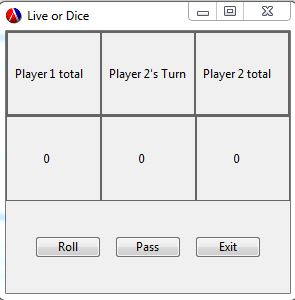

# Live-Or-Dice

##Authors

* Charlie Sopiep
* Taner Albayrak
* Long Tran

##Overview

A basic GUI program of the game called Pig the Dice. The game has two players, where each player takes turn rolling a dice up to 100.
Rules are very simple:
* Each player rolls until they hit either 1 or they pass.
  * Rolling 1 will reset their total score for that turn.
  * Pass will let them keep their score (also adding on to the last turn).
  * The objective of the game is to get to 100 points before the other player.

##Screenshot


##Concepts Demonstrated
* **Data abstraction** is used find the conditions of changing players.
* **Symbolic Data** helped us with the conditions of winningthe game.
* **Environments and Objects** was our base concept of how to code this program.

##External Technology and Libraries
Our main library was racket's own GUI (racket/gui/base) library.  It gave us the tools to make everything work with the program we coded. Also with the help of DrRacket and GitHub to make everything accessible for our team to work together.

##Favorite Lines of Code
####Charlie (a team member)
"A button that really determines who wins, not the roll button of course."
```scheme
(new button% [parent bpanel1] 
     [label "Pass"]
     [callback (lambda (t e) 
             (if (equal? state "Player 1's Turn") 
             (begin(set! state "Player 2's Turn")(p2)(p1store)(p3)(set! rolltrac 0)(p4))
             (begin(set! state "Player 1's Turn")(p1)(p2store)(p5)(set! rolltrac 0)(p4))
             ))]
     )
```

####Taner (another team member)
"It initializes the actual window and shows how to display it."
```scheme
(define mainframe (new frame% [label "Live or Dice"]
                              [alignment '(center bottom)]
                              [width 300] 
                              [height 300]
                              ))
```

####Long (another team member)
"Who doesn't like to know who wins, I do."
```scheme
(define (p1win) (message-box "Results" "Player One Wins     " mainframe '(ok)))
(define (p2win) (message-box "Results" "Player Two Wins     " mainframe '(ok)))
```

##Additional Remarks
We did enjoy writing this code together, but we wished this was more of a semester long project so we could've polished it much more than we wanted.

#How to Download and Run
Should be able to download the package, extract it and run the .rkt in the folder, properly without any other externals aside from using DrRacket. Also press roll again when one of the players hit 100.
[Program link here](https://github.com/oplS15projects/Live-Or-Dice/releases/tag/v1.0)
